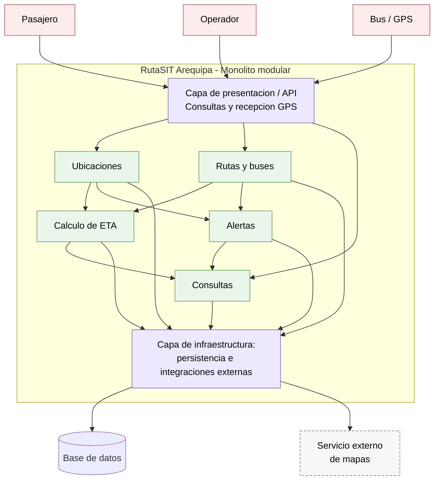

# RutaSIT Arequipa — Laboratorio 04: Fundamentos de arquitectura de software

Construcción de Software · EPIS-UNSA · 2026-B · Grupo 06

## Integrantes

| Nombre | Rol en el laboratorio |
|--------|------------------------|
| Mathias Dario Davila Flores | Redactor de ADR, diagramador y verificador de IA |
| Deivick Paul Eddi Chavez Cuno | Revisor de arquitectura y documentación |

## Caso

**RutaSIT Arequipa** es un sistema de seguimiento en tiempo real de buses orientado a pasajeros y operadores del servicio. El MVP permite visualizar la ubicación de los buses en un mapa, consultar el tiempo estimado de llegada a los paraderos y recibir alertas relacionadas con desvíos o congestión. Los buses proporcionan periódicamente su posición mediante dispositivos GPS. El atributo de calidad crítico es el **rendimiento**: 300 buses envían su posición cada 10 segundos y el ETA debe actualizarse en un máximo de 15 segundos.

## Arquitectura elegida

## Decisiones arquitectónicas

- [ADR-001: Adoptar un monolito modular como estilo arquitectónico](docs/architecture/adr/001-estilo-arquitectonico.md)
- [ADR-002: Utilizar HTTP/REST para la ingesta de posiciones GPS](docs/architecture/adr/002-ingesta-posiciones-gps.md)
- [ADR-003: Utilizar Server-Sent Events para actualizaciones en tiempo real](docs/architecture/adr/003-actualizacion-tiempo-real.md)

## Reflexión sobre el uso de IA

La IA permitió explorar y comparar alternativas arquitectónicas con mayor rapidez, pero sus propuestas fueron tratadas como recomendaciones y no como decisiones definitivas. Durante el desarrollo se contrastaron sus respuestas con los requisitos, atributos de calidad y restricciones definidos para RutaSIT. Algunas propuestas fueron corregidas o rechazadas cuando añadían complejidad innecesaria o no representaban adecuadamente la arquitectura del caso. También se verificaron cálculos, puntajes de la matriz y la coherencia entre los ADR y los diagramas. El proceso mostró que la IA es útil para ampliar las opciones de análisis y detectar posibles riesgos. Sin embargo, sus respuestas requieren validación porque pueden asumir condiciones que no están especificadas en el problema. La decisión final sobre cada elemento arquitectónico permaneció bajo responsabilidad del equipo.